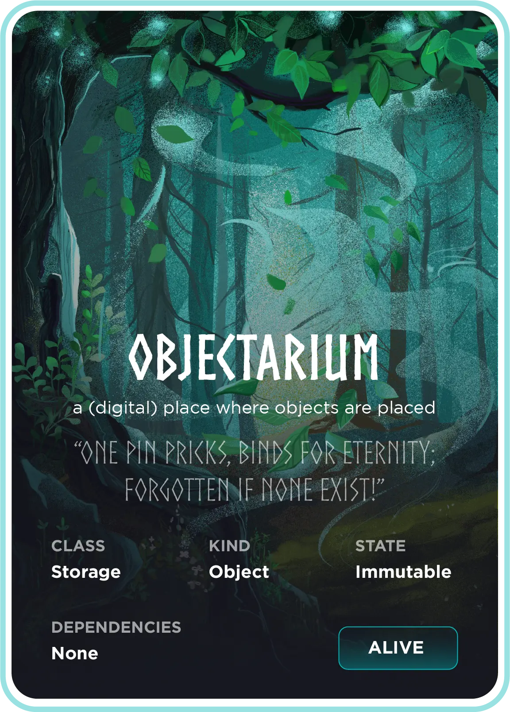
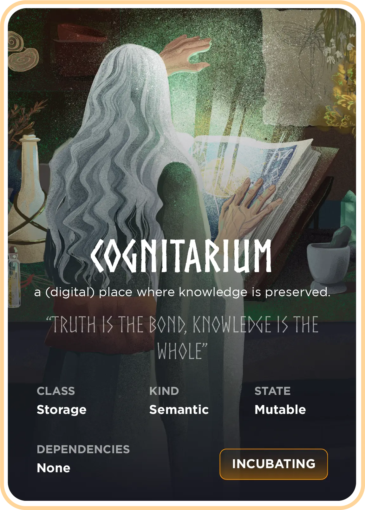
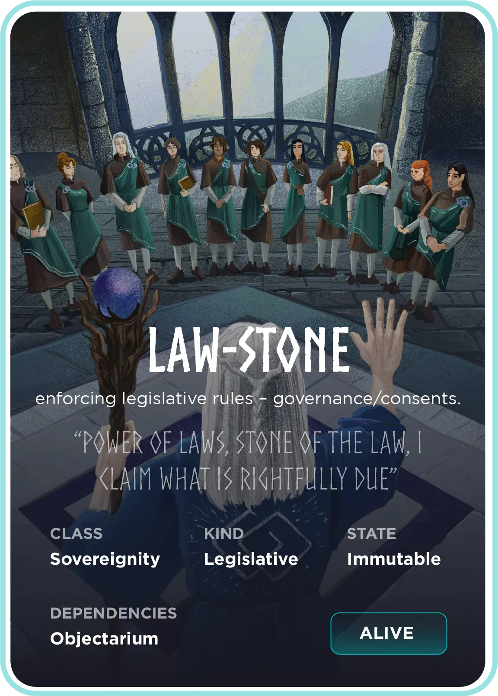
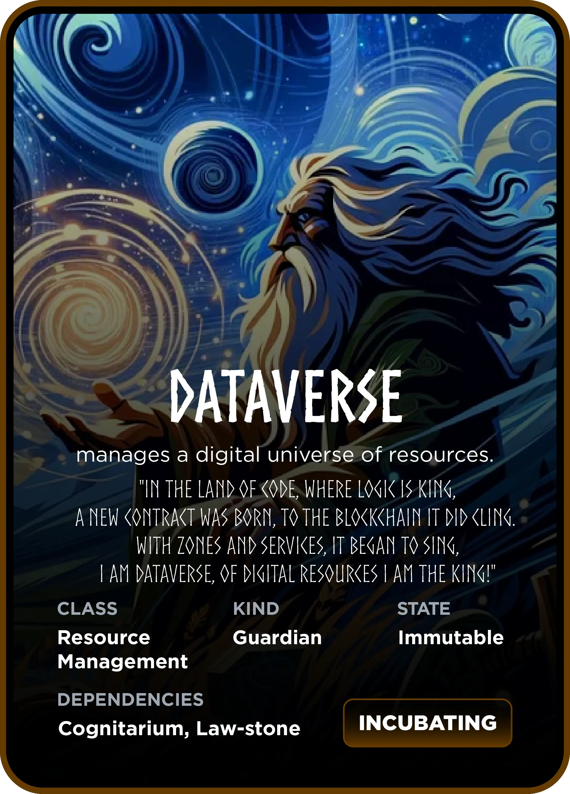

# 📜 AXONE Smart Contracts

> [CosmWasm](https://cosmwasm.com) contracts for the [AXONE network](http://axone.xyz).

[](https://github.com/axone-protocol/contracts/actions/workflows/build.yml)
[](https://github.com/axone-protocol/contracts/actions/workflows/lint.yml)
[](https://github.com/axone-protocol/contracts/actions/workflows/test.yml)
[](https://app.codecov.io/gh/axone-protocol/contracts)
[](https://conventionalcommits.org)
[](https://github.com/semantic-release/semantic-release)
[](https://opensource.org/licenses/BSD-3-Clause)

## ✨ Smart Contracts

This repository hosts Smart Contracts that are deployed on the [AXONE network](http://axone.xyz). But they are compatible with any
[Cosmos blockchains](https://cosmos.network/) that uses the [CosmWasm](https://cosmwasm.com/) framework.

### 🗄️ Storage oriented Smart Contracts

> The class of Smart Contracts which act as reliable repositories, offering secure, efficient, and auditable storage
> and retrieval of various data types on the blockchain.

<table>
  <tr>
    <th rowspan="4">
      <a href="https://docs.axone.xyz/contracts/next/axone-objectarium"></a>
      <br/><sub><a href="https://docs.axone.xyz/contracts/next/axone-objectarium">→ Tech documentation</a></sub>
    </th>
  </tr>
  <tr>
    <td>
      <a href="#---mature-stage">
      
      </a>
      <a href="https://github.com/axone-protocol/contracts/releases" target="_blank">
      
    </a>
    </td>
  </tr>
  <tr>
    <td>
<p>A Smart Contract which enables the storage of arbitrary unstructured <a href="https://en.wikipedia.org/wiki/Object_storage" target="_blank">Objects</a> in any <a href="https://cosmos.network/">Cosmos blockchains</a>.</p><p>It provides a flexible solution for storing data without imposing strict schemas or predefined structures, accommodating various data formats and types.</p>
    </td>
  </tr>
  <tr>
    <td>
      
      <a href="https://en.wikipedia.org/wiki/Object_storage" target="_blank">
      
      </a>
      
    </td>
  </tr>
</table>

<table>
  <tr>
    <th rowspan="4">
      <a href="https://docs.axone.xyz/contracts/next/axone-cognitarium"></a>
      <br/><sub><a href="https://docs.axone.xyz/contracts/next/axone-cognitarium">→ Tech documentation</a></sub>
    </th>
  </tr>
    <tr>
    <td>
      <a href="#---intermediate-stage">
      
      </a>
      <a href="https://github.com/axone-protocol/contracts/releases" target="_blank">
      
    </a>
    </td>
  </tr>
  <tr>
    <td><p>A Smart Contract which facilitates the storage and querying of semantic data using <a href="https://en.wikipedia.org/wiki/Resource_Description_Framework">RDF (Resource Description Framework)</a>, which represents information as semantic triples.</p><p>In essence, it serves as a repository for knowledge, providing a dedicated space for storing and retrieving semantic information within any <a href="https://cosmos.network/">Cosmos blockchains</a>.</p></td>
  </tr>
  <tr>
    <td>
      
      <a href="https://en.wikipedia.org/wiki/Triplestore" target="_blank">
      
      </a>
      
    </td>
  </tr>
</table>

### ⚖️ Sovereignty oriented Smart Contracts

> The class of Smart Contracts designed to prioritize the sovereignty of the involved parties by allowing them to define and enforce their own rules and regulations.

<table>
  <tr>
    <th rowspan="4">
      <a href="https://docs.axone.xyz/contracts/next/axone-law-stone"></a>
      <br/><sub><a href="https://docs.axone.xyz/contracts/next/axone-law-stone">→ Tech documentation</a></sub>
    </th>
  </tr>
  <tr>
    <td>
      <a href="#---mature-stage">
      
      </a>
      <a href="https://github.com/axone-protocol/contracts/releases" target="_blank">
      
    </a>
    </td>
  </tr>
  <tr>
    <td>
<p>A multifaceted Smart Contract designed to express and evaluate legal content, including but not limited to regulations, agreements, consents and permissions.</p><p>It offers extraordinary adaptability and can be utilized in any blockchain within the <a href="https://cosmos.network/">Cosmos ecosystem</a> that seeks to establish robust and flexible <em>on-chain governance</em> systems.</p>
    </td>
  </tr>
  <tr>
    <td>
      
      <a href="https://en.wikipedia.org/wiki/Logic_programming" target="_blank">
      
      </a>
      
    </td>
  </tr>
</table>

### 🌐 Resource Management oriented Smart Contracts

> The class of Smart Contracts designed to manage and orchestrate the lifecycle of various resources in the Dataverse.

<table>
  <tr>
    <th rowspan="4">
      <a href="https://docs.axone.xyz/contracts/next/axone-dataverse"></a>
      <br/><sub><a href="https://docs.axone.xyz/contracts/next/axone-dataverse">→ Tech documentation</a></sub>
    </th>
  </tr>
  <tr>
    <td>
      <a href="#---genesis-stage">
      
      </a>
      <a href="https://github.com/axone-protocol/contracts/releases" target="_blank">
      
    </a>
    </td>
  </tr>
  <tr>
    <td>
<p>A Smart Contract responsible for overseeing and managing the <a href="https://docs.axone.xyz/whitepaper/solution#the-dataverse">Dataverse</a> within the <a href="https://axone.xyz">AXONE network</a>.</p><p>The Dataverse is an ever-expanding universe that encompasses a wide range of Digital Resources, including datasets, data processing algorithms, ML algorithm, storage resources, computational resources, identity management solutions, orchestration engines, oracles, and many other resources recorded on the blockchain.</p>
    </td>
  </tr>
  <tr>
    <td>
      
      
    </td>
  </tr>
</table>

## 🥚 Maturity

The maturity of each contract is indicated by the following emojis.

### 💥 - Genesis Stage

This stage represents the initial spark or idea that leads to the development of the Smart Contract.

### 🥚 - Initial Stage

The Smart Contract is still in its infancy, with basic functionalities just being implemented. It is still under development, and its evolution may lead to breaking changes. It is not recommended for production use.

### 🐣 - Intermediate Stage

The Smart Contract has undergone a number of tests and improvements, and presents a coherent functional package, but may still lack some advanced features or optimizations. It can be used in production in testnets.

### 🐥 - Mature Stage

The Smart Contract is fully developed and tested. It's considered safe for production use, offering robust features and optimized performance.

## 🗂 Directory Structure

The project is structured around a set of Rust workspaces, each defining a Smart Contract.

```text
.
├── contracts
│   └── <contract>
│       ├── Cargo.toml
│       ├── examples
│       ├── schema
│       └── src
├── packages
│   └── <package>
│       ├── Cargo.toml
│       ├── examples
│       └── src
└─── Cargo.toml
```

## 🏗 Build

### 🔨 Pre-requisites

Be sure you have the following tools installed:

- [Rust](https://www.rust-lang.org/tools/install) v1.75 or higher
- [cargo-make](https://github.com/sagiegurari/cargo-make) v0.36.3 or higher
- [Docker](https://docs.docker.com/get-docker/)
- [jq](https://stedolan.github.io/jq/download/) v1.6 or higher
- [npx](https://www.npmjs.com/package/npx) v8.19.2 or higher

And the following common [GNU Core utilities](https://en.wikipedia.org/wiki/List_of_GNU_Core_Utilities_commands):

- [shasum](https://linuxhint.com/shasum-linux/) v6.02 or higher
- [sed](https://www.gnu.org/software/sed/) v4.8 or higher

### 🔧 Compiling Smart Contracts to Wasm

To compile the Smart Contracts to Wasm, just invoke the `wasm` goal of the makefile:

```sh
cargo make wasm
```

This will install the rust Wasm toolchain, if not already done, and start the process for compiling the Smart Contracts
to Wasm.

## ✅ Test Smart Contracts

The Smart Contracts are under unit testing. The tests can be launched with the following invocation:

```sh
cargo make test-coverage
```

## 🏓 Play with the Smart Contracts

The project comes with a set of convenient tasks to manage the Smart Contracts and the blockchain.
To see the list of available tasks, run the following command:

```sh
cargo make --list-all-steps | grep chain | sort | sed -r 's/chain(-?[a-zA-Z\-]*)/- `chain\1`/'
```

The list of available tasks for managing the chain is as follows:

- `chain` - Run the axoned CLI using the chain's home directory under a Docker container.
- `chain-add-keys` - Add a set of predefined keys (recovered from the seed phrases) to the chain.
- `chain-clean` - Clean the chain data (⚠️ definitively)
- `chain-deploy-contract` - Deploy a specific contract to the chain. The contract must be compiled and the wasm file must be present in the artifacts directory (under target/wasm32-unknown-unknown/...).
- `chain-deploy-contracts` - Deploy all the available contracts to the chain (under target/wasm32-unknown-unknown/...).
- `chain-execute-contract` - Execute a command on a specific contract to the chain. The contract must be already deployed and instantiated.
- `chain-init-folder` - Initialize deploy folder to make sure scripts have the right permission (needed for linux)
- `chain-initialize` - Initialize the chain with a validator's key and a set of predefined keys. ⚠️ The home directory is cleaned before.
- `chain-inspect-contract` - Inspect a specific contract deployed to the chain.
- `chain-instantiate-contract` - Instantiate a specific contract to the chain. The contract must be already deployed.
- `chain-list-contracts` - List all the contracts deployed to the chain.
- `chain-logs` - Show the chain's container logs.
- `chain-query-contract` - Query a specific contract to the chain. The contract must be already deployed and instantiated.
- `chain-start` - Run the full node axoned application using the chain's home directory under a Docker container.
- `chain-stop` - Stop the chain's container.

## 💻 Develop

### 🚀 Initialize the chain

To initialize the chain, just run:

```sh
cargo make chain-initialize
```

This will initialize the chain's home directory and create a validator's key and a set of predefined keys
(recovered from the seed phrases).

### 🟢 Start the chain

To start the chain, just run:

```sh
cargo make chain-start
```

This will start the chain's container and run the full node wasmd application.

You can check the chain's logs with:

```sh
cargo make chain-logs
```

### 🛳 Deploy the Smart Contracts

To deploy the Smart Contracts, just run:

```sh
cargo make chain-deploy-contracts
```

This will deploy all the available contracts to the chain. For this, the contracts must be compiled and the wasm files
must be present in the artifacts directory. See the [Build](#-build) section for more details.

Now, you can interact with the deployed Smart Contracts and test them out.

### 🎮 Free execution of the CLI command

You can freely interact with the local chain by executing the following CLI command. This will execute the `axoned`
binary
inside a Docker container with the `--home` argument pointing to the chain's home directory and using the same network
as
the chain's container. The arguments passed to the command will be directly passed to the `axoned` binary.

```sh
cargo make chain <command>
```

For example, to check the status of the chain, just run:

```sh
cargo make chain status
```

### 🔴 Stop the chain

To stop the chain, just run:

```sh
cargo make chain-stop
```

### 🧼 Clean the chain

To clean the chain, just run:

```sh
cargo make chain-clean
```

⚠️ Please be cautious when running this command as it will completely clean the chain's home directory and the action is
irreversible.

### 🏗 Smart Contracts scaffolding

When developing a new Smart Contract, you can use the scaffolding to generate the Smart Contract's code.

#### 🔨 Pre-requisites

Be sure you have the following tools installed:

- [ffizer](https://ffizer.github.io/ffizer/book/#install) v2.10.3 or higher

#### 🚧 Generate the scaffolding

To generate the scaffolding, just run:

```sh
cargo make scaffold-smart-contract
```

Then, follow the instructions.

## 📚 Documentation

The documentation of the Smart Contracts must be committed to the repository. The documentation is generated from the
Smart Contracts' schema.

To generate the documentation follow the steps below.

### 🔨 Pre-requisites

Be sure you have the following tools installed:

- [Yarn](https://classic.yarnpkg.com/en/docs/install) v1.22.10 or higher

Then, install the dependencies:

```sh
yarn global add @adobe/jsonschema2md@7.1.5
```

### 🖨 Generate the documentation

To generate the documentation, just run:

```sh
cargo make schema
cargo make docs-generate
```

You'll find the generated documentation under the `docs` folder.

### 🗒 Commit the documentation

When developing a new contract, you should commit the generated documentation to the repository. For this, generate the
documentation and commit the changes:

```sh
git commit -am "docs: update generated documentation"
```

## 🍀 Quality assurance approach

⛓ - The enforcement of stringent rules, monitored by a linter ([Clippy](https://github.com/rust-lang/rust-clippy)) within the Github CI environment.

🤖 - A high level of code coverage through systematic unit testing.

💫 - Future considerations for additional testing approaches, such as fuzzy testing or end-to-end testing, to further enhance quality.

## 🛡️ Audit

| Date | Auditor | Version | Report |
|---|---|---|---|
| 2024/08/08 | [BlockApex](https://blockapex.io/) | [0cae9ec (v6.0.0)](https://github.com/axone-protocol/contracts/tree/0cae9ecf24c4ded86abecd34aec2303e82413672) | [Axone Smart Contract Audit Report.pdf](https://github.com/BlockApex/Audit-Reports/blob/15d8765ac45b4a83bb2f1446fc9bf869c123f8d2/Axone%20Smart%20Contract%20Audit%20Report.pdf)|

## 📘 Resources

- [CosmWasm Docs](https://docs.cosmwasm.com/)
- [AXONE Whitepaper](https://docs.axone.xyz/whitepaper/abstract)
- [AXONE Blockchain](https://github.com/axone-protocol/axoned)

## You want to get involved? 😍

So you want to contribute? Great! ❤️ We appreciate any help you're willing to give. Don't hesitate to open issues and/or
submit pull requests.

We believe that collaboration is key to the success of the AXONE project. Join our Community discussions on the [Community Repository](https://github.com/axone-protocol/community) to:

- Engage in conversations with peers and experts.
- Share your insights and experiences with AXONE.
- Learn from others and expand your knowledge of the protocol.

The Community Repository serves as a hub for discussions, questions, and knowledge-sharing related to AXONE. We encourage you to actively participate and contribute to the growth of our community.

Please check out AXONE health files:

- [Contributing](https://github.com/axone-protocol/.github/blob/main/CONTRIBUTING.md)
- [Code of conduct](https://github.com/axone-protocol/.github/blob/main/CODE_OF_CONDUCT.md)
